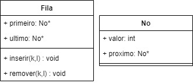

## Exercício

1) Para cada estrutura abaixo, implemente os métodos contido(K,L), inserir(K,L) e remover(K,L) e
   verifique as complexidades de cada método. No caso de filas e pilhas, o remover(K,L) não terá o
   argumento K, visto que filas e pilhas removem sempre quem está na extremidade.

   **b)** Fila com lista simplesmente encadeada: considere que vc tem uma variável head e uma tail, onde head marca a cabeça e tail o ultimo nó na cauda.

**Solução:** 

- Estrutura:


  

- Método _inserir(K,L)_: Como não há demanda do do médodo _contido(K,L)_, _inserir(K,L)_ se torna **O(1)**.

```
 void Fila::inserir(int k, Fila *l) {
    No *novoNo = new No();
    novoNo->valor = k;

    if (isVazia(l)) {
        l->primeiro = novoNo;
    } else {
        l->ultimo->proximo = novoNo;
    }

    l->ultimo = novoNo;
}
```

- Método _remover(K,L)_: Como não há demanda do do médodo _contido(K,L)_, _remover(K,L)_ se torna **O(1)**.

```
No *Fila::remover(Fila *l) {
    if (!isVazia(l)) {
        No *no = l->primeiro;

        if (l->primeiro == l->ultimo) {
            l->primeiro = l->ultimo = nullptr;
        } else {
            l->primeiro = l->primeiro->proximo;
        }

        return no;
    } else {
        cout << "A fila está vazia" << endl;
        return nullptr;
    }
}
``` 