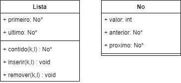

## Exercício

1) Para cada estrutura abaixo, implemente os métodos contido(K,L), inserir(K,L) e remover(K,L) e
   verifique as complexidades de cada método. No caso de filas e pilhas, o remover(K,L) não terá o
   argumento K, visto que filas e pilhas removem sempre quem está na extremidade.

   d) Lista duplamente encadeada circular.

**Solução:** 

- Estrutura:


  


- Método _contido(K,L)_: A lista de tamanho _K_ é percorrida em busca do elemento, que em pior caso fornece complexidade linear. Logo, para n = |L|, este método é **O(n)**.
```
No* Lista::contido(int k, Lista *l) {
    l->primeiro->valor = k;
    No* no = l->primeiro->proximo;

    while(no->valor!=k) {
        no=no->proximo;
    }

    l->primeiro->valor = DUMMY;

    return no;
}
```

- Método _inserir(K,L)_: Pela demanda de uma busca, através do método _contido(K,L)_, por um possível duplicidade de chave _K_, o método atual depende da complecidade do médodo _contido(K,L)_. Logo, _inserir(K,L)_ é **O(n)**.

```
void Lista::inserir(int k, Lista *l) {

    No* no = contido(k,l);

    if(no->valor==DUMMY) {
        No *novoNo = new No();
        novoNo->valor = k;
        novoNo->anterior = l->ultimo;
        novoNo->proximo = l->ultimo->proximo;

        l->ultimo->proximo = novoNo;
        l->ultimo = novoNo;
    } else {
        l->primeiro->valor = DUMMY;
        cout << "A chave já está na lista" << endl;
    }
}
```

- Método _remover(K,L)_: Pela demanda de uma busca, através do método _contido(K,L)_, por um possível duplicidade de chave _K_, o método atual depende da complecidade do médodo _contido(K,L)_. Logo, _remover(K,L)_ é **O(n)**.

```
void Lista::remover(int k, Lista *l) {

    if(!isVazia(l)) {

        No* no = contido(k,l);

        if(no->valor!=DUMMY) {

            no->anterior->proximo = no->proximo;
            no->proximo->anterior = no->anterior;

            if(no->anterior == l->primeiro && no->proximo == l->primeiro) { //É o unico nó?
                l->ultimo = l->primeiro;
            }else {
                if(no == l->ultimo) { //É o ultimo nó?
                    l->ultimo = no->anterior;
                }
            }

            delete no;

            cout<<"Chave "<<k<<"  removida"<<endl;

        }else {
            cout<<"A chave não está na lista"<<endl;
        }
    }else {
        cout<<"A lista está vazia"<<endl;
    }
}
``` 