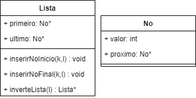

## Exercício

2) Seja L uma lista simplesmente encadeada. Escreva um algoritmo que, percorrendo a lista uma única vez, constrói:
 
**Solução:** 

- Estrutura:


  


- Método _inverteLista(Lista *l)_:
```
Lista *Lista::inverteLista(Lista *l) {
    Lista *l2 = new Lista();

    No* no = l->primeiro;

    while(no!=nullptr) {
        inserirInicio(no->valor,l2);
        no = no->proximo;
    }

    return l2;
}
```
