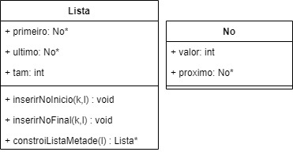

## Exercício

2) Seja L uma lista simplesmente encadeada. Escreva um algoritmo que, percorrendo a lista uma única vez, constrói:
 
    **b)** Uma lista L’' que possui a metade dos nós da lista L, onde o primeiro nó de L’' contém a soma do primeiro nó de L com o último nó de L, o segundo nó de L’ contém a soma do segundo nó de L com o penúltimo nó de L e assim por diante: L''= < L1+Ln, L2+Ln-1, L3+Ln-2, … , Ln/2 + Ln/2+1>, onde n é sempre par.


**Solução:** 

- Estrutura:


  


- Método _constroiListaMetade(Lista *l)_:
```

Lista *Lista::constroiListaMetade(Lista *l) {
    Lista *l2 = new Lista();
    Lista* lAux = new Lista();

    //Passando a primeira metade de L1 para a lista de retorno
    No* no = l->primeiro;
    for(int i = 0; i < l->getTam()/2; i++) {
        inserirFinal(no->valor,l2);
        no = no->proximo;
    }

    //Passando a segunda metade de L1 para uma lista auxiliar em ordem infertida
    for(int i = l->getTam()/2; i < l->getTam() ; i++) {
        inserirInicio(no->valor,lAux);
        no = no -> proximo;
    }

    no = lAux->primeiro;
    No* no2 = l2->primeiro;
    //Somando o conteudo invertido da lista auxiliar para a lista de retorno
    while(no2!=nullptr) {
        no2->valor+=no->valor;
        no2 = no2->proximo;
        no = no->proximo;
    }

    return l2;
}
```
