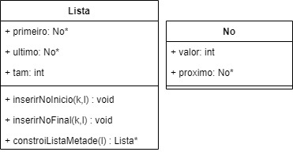

## Exercício

2) Escreva um algoritmo para reconhecer se uma dada palavra é um palíndromo. Considere que a palavra está contida em uma lista simplesmente encadeada, onde cada caractere está em um nó da lista.

**Solução:** 

- Estrutura:


  


- Método _constroiListaMetade(Lista *l)_:
```

Lista *Lista::constroiListaMetade(Lista *l) {
    Lista *l2 = new Lista();
    Lista* lAux = new Lista();

    //Passando a primeira metade de L1 para a lista de retorno
    No* no = l->primeiro;
    for(int i = 0; i < l->getTam()/2; i++) {
        inserirFinal(no->valor,l2);
        no = no->proximo;
    }

    //Passando a segunda metade de L1 para uma lista auxiliar em ordem infertida
    for(int i = l->getTam()/2; i < l->getTam() ; i++) {
        inserirInicio(no->valor,lAux);
        no = no -> proximo;
    }

    no = lAux->primeiro;
    No* no2 = l2->primeiro;
    //Somando o conteudo invertido da lista auxiliar para a lista de retorno
    while(no2!=nullptr) {
        no2->valor+=no->valor;
        no2 = no2->proximo;
        no = no->proximo;
    }

    return l2;
}
```
